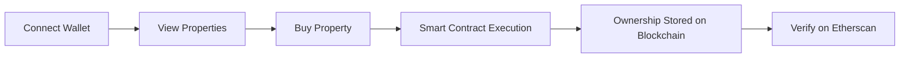

# 🏠 BlockEstate

### 🚀 Blockchain-Based Real Estate Platform (Next.js + Web3)

<p align="center">
  
  
  
  
  
  
  
</p>

<p align="center">
  <b>Own Real Estate Digitally with Blockchain 🔐</b><br>
  Built using Next.js, Smart Contracts & Web3
</p>

---

## ✨ Features

* 🔐 Wallet Authentication (MetaMask)
* 🏘️ Dynamic Property Listings (Next.js Rendering)
* 🏠 Direct Property Purchase (Full Ownership)
* 📜 Smart Contract-Based Ownership
* 🔎 Transaction Verification via Etherscan
* ⚡ Fast Performance (SSR/CSR with Next.js)
* 🗄️ MongoDB Integration

---

## 🧠 How It Works



---

## 🛠️ Tech Stack

| Layer              | Technology                |
| ------------------ | ------------------------- |
| 🎨 Frontend        | Next.js (React Framework) |
| ⚙️ Backend         | Node.js / API Routes      |
| 🗄️ Database       | MongoDB Atlas             |
| 🔗 Blockchain      | Ethereum Sepolia          |
| 📜 Smart Contracts | Solidity                  |
| 🔌 Web3            | Ethers.js                 |
| ☁️ Deployment      | Vercel                    |

---

## 📂 Project Structure

```bash
blockestate/
│
├── pages/ or app/     # Next.js routing
├── components/        # UI components
├── styles/            # Styling
├── public/            # Static assets
├── contracts/         # Smart contracts
├── utils/             # Web3 logic
└── README.md
```

---

## ⚙️ Installation & Run

```bash
# Clone repo
git clone https://github.com/your-username/blockestate.git

# Install dependencies
npm install

# Run development server
npm run dev
```

👉 Open: [http://localhost:3000](https://blockestate-orpin.vercel.app/)

---

## 🌐 Deployment

* Hosted on **Vercel**
* Blockchain on **Ethereum Sepolia Testnet**

---

## 🔗 Smart Contract

* Language: Solidity
* Tool: Remix IDE
* Connected via Ethers.js

---

## 📊 Future Scope

* 🪙 Token-based fractional ownership
* 📈 Property analytics dashboard
* 🏦 Rent distribution system
* 📱 Mobile optimization

---

## 👩‍💻 Author

**Swati Shinde**
🚀 Blockchain & Next.js Developer

---

## ⭐ Support

If you like this project, give it a ⭐ on GitHub!
